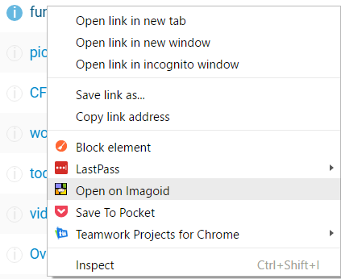

# Chrome Imagoid
A chrome extension for opening subreddits on Imageoid.

### What is it?
Chrome Imagoid is a simple chrome extension that adds a right click menu for opening a subreddit on the Reddit gallery website Imagoid. If you right click on a link for a subreddit ( for example, on http://redditlist.com ), you'll get a menu option to "Open on Imagoid".




### How to I install it?

You can install it in 2 ways. Either use the prepacked chrome extension, or build it yourself.

#### Using the prepackaged chrome extension.

Download the .crx file [here](extension/chrome-imagoid.crx). In chrome, open up [chrome://extensions](chrome://extensions) and drag the crx file you downloaded onto the extensions page.


#### Building the extension yourself.

Make sure you have [Node.js](https://nodejs.org) installed. You also need [NPM](http://npmjs.com) which comes prebundled with Node.

Open up a terminal window and run
```
git clone https://github.com/smithalan92/chrome-imageoid.git
```

Once the repository is cloned, navigate into the directory `cd chrome-imageoid`

Run `npm install` to install the required dependencies for building. Once `npm install` has finished. Run `gulp` to compile the project. A `dist` folder will be created with the project files.

Open up Chrome and go to [chrome://extensions](chrome://extensions). Tick the checkbox to enable developer mode. Chose the "Load Unpacked Extension" button at the top of the page. Navigate to the `dist` directory in `chrome-imageoid` and click OK. Done, Chrome Imagoid should now be available for any subreddit links.
